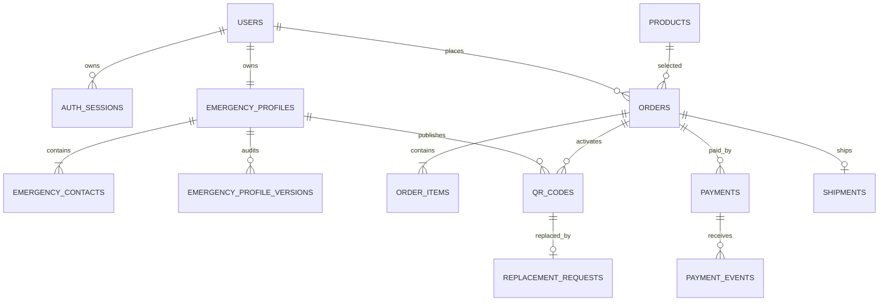

# Database schema

Flyway migration `V1__baseline.sql` creates UUID-keyed relational tables, UTC `timestamptz` audit fields, integer paise amounts, constrained states, and targeted indexes. Hibernate validates only; it does not mutate the schema.

`physical_sticker_serial_seq` starts at 1, never cycles, and is independent of the UUID key and random public token. Sequence gaps are expected. Live profile content is not snapshotted into QR payloads; `emergency_profile_versions` preserves consent/edit history. Order price, address, payment, status, and fulfillment records remain historical.
